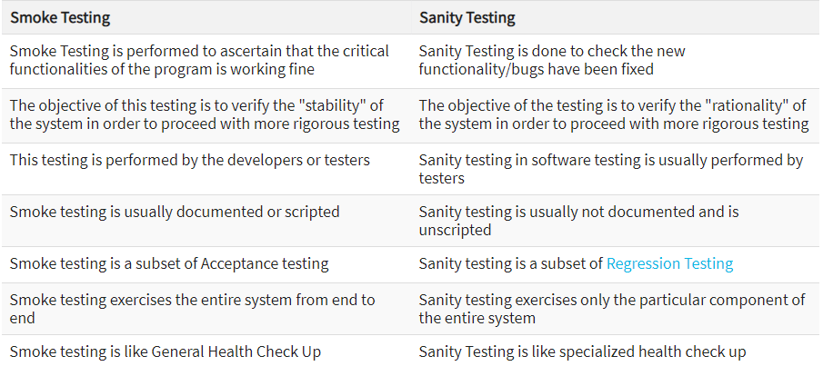

## 

Sanity Testing 와 Smoke Testing 는 분간하기 어려워하는 테스팅 종류 중 하나이다.

Sanity Testing 및 Smoke Testing 용어에 대하여 실무에서 올바르게 사용할 수 있도록 두 테스팅의 차이점과 방식에 대해서 작성하고자 한다.

### Sanity Testing 이란 ?

**Sanity** 란 단어 자체가 "온전한" 뜻을 가진 단어인 만큼 Sanity Testing 은 기본적인 목적은 SW 개발 이후에 온전한 상태로 수행 가능한지를 판별하는 테스팅이라고 보면 될 것 같다.

어떠한 개발 이후, Bug (결함) 이 수정되었고 이 변경 사항으로 인하여 Bug(결함) 이 정상적으로 수정되었고 Side Effect 이 발생하는지 확인하는 테스트 방법 중 하나이다.

빠르게 해당 수정된 Bug (결함) 과 그로 인한 Side Effect 을 확인하여 최초에 계획된 테스트 수행에 의한 시간을 절약하기 위한 테스트 방법이며, Sanity Testing 이 실패 하였을 경우에는 계획된 테스트 수행은 진행하지 않고, 다시 재 수정 단계를 거쳐야 한다.

예로 들면, 배포 일정에 대하여 Bug (결함) 수정 포함되어 있다고 가정 하였을 경우 각 수정에 대한 내용과 그로인한 연계된 내용을 먼저 확임함으로써, 온전한 테스트가 계획대로 수행될 수 있는지를 판단하고 통과 되었을 경우에 신규 기능까지 계획 대로의 테스트가 수행된다고 보면 될 것 같다.

### Smoke Testing 이란 ?

**Smoke** 란 단어의 뜻처럼 "연기" 가 있는 상태에서 진행한다는 뜻으로 Smoke Testing 의 기본적인 목적은 기능 개발, 수정 이후에 주요 기능등이 동작하여 기존에 계획된 테스트가 온전히 수행될 수 있는지를 판단하는 테스팅이라고 보면 될 것 같다.

어떠한 개발 이후, 테스트 계획에 포함되는 범위 중 중요한 부분에 대한 테스트를 빠르게 진행하여 테스트 계획대로 온전한 테스트가 수행 가능한지를 판별하고 테스트 엔지니어가 테스트를 수행함에 있어 비 정상적인 상태의 제품을 테스트 하는 시간을 낭비하지 않도록 함에 그 목적이 있다.

비슷한듯 하지만, 목적과 그 수행 시기에 따라 두 방법은 분류되고 있고
Sanity Testing 와 Smoke Testing 외에도 Regression Testing 과도 서로의 목적과 수행 시기에 따라 분류할 수 있다.

간략하게 정의 하자면 **Smoke Testing** 는 테스트 부서에게 전달 전 Build 된 소프트웨어에 대한 유효성을 검증하는 단계에서의 Test 이고,

**Sanity Testing** 는 테스트 부서에게 전달 후, Build 된 소프트웨어에 대한 유효성을 검증하는 단계에서의 Test 이다.

이 단계 이후에 System 또는 Regression Test 가 진행된다고 보면 될 것 같다.

참조 : Sanity Testing Vs Smoke Testing: Introduction and Differences

작성자 : 현의노래

작성일 : 2021년 05월 04일