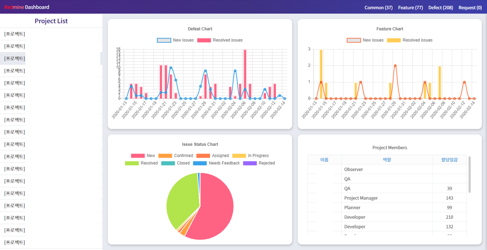

## 프로젝트 대시보드


**레드마인** 에는 기본적으로 많은 대시보드 플러그인이 제공되지만, 기본적으로 이쁘지 않다.

아무래도 오픈소스 기반이다 보니 플러그인 중에 쓸만한 것들은 거의 유료 이고 **레드마인** 메이저 버전이 업데이트 되면서 기존 지원하던 **플러그인**이 DB 변경등으로 인하여 쓸 수 없는 경우도 많다.


재직중인 회사에서는 기본적으로 사내 LDAP 로 모든 ALM 을 접근하고, 각 ALM 에 등록 관리되는 프로젝트는 담당자 별로 별도 권한을 부여하고 있어, 각 프로젝트 별 진척이나 여러 품질의 현황을 보고 싶다는 생각이 들어 연습삼아 우선적으로 사내에서 ALM 도구로 사용중인 **레드마인** 을 기준으로 대시보드를 만들어 보았다.


> 언어 : python (flask, redmineapi)
>
> 구조 : common / redmine api / flask api
>
> >Redmine_Tokken.py : 기본적인 레드마인의 URL 과 API 토큰 처리를 위해 만들었다.
> >
> >Redmine_info.py : 레드마인 API 를 호출하여 필요한 정보를 함수화 하기 위해 만들었다.
> >
> >:::info
> >
> >Redmine 4버전은 API 버전이 변경되어 쓸 수 없다.
> >
> >:::
> >
> >Api_response.py : Redmine_info 레드마인 데이터 값을 자체 API 의 json 으로 변경하기 위해 만들었다.


### Redmine_Tokken.py

```python
import sys
import os
from redminelib import Redmine

sys.path.append(os.path.dirname(os.path.abspath(os.path.dirname(__file__))))

# 레드마인 주소
info_url = '레드마인주소를 입력한다.'

# 레드마인 인증 작업
def redmine_token():
    redmine = Redmine(info_url, requests={'verify': False}, key='api 키값을 입력한다.')
    return redmine
```


### Redmine_info.py

```python
import sys
import os
from redminelib import Redmine
import json
from collections import OrderedDict
from datetime import datetime
import array

sys.path.append(os.path.dirname(os.path.abspath(os.path.dirname(__file__))))

from Common import Redmine_Tokken

# 조회 기준 날짜
날짜 = 31

# 레드마인 등록된 총 프로젝트 갯수를 반환
def project_count():

    count = 0
    
    for project in Redmine_Tokken.redmine_token().project.all():
        count = count + 1
    return count

# 레드마인에 등륵된 모든 프로젝트 정보 리스트 반환
def project_list_original():

    pj_name = []; pj_id = []; pj_list = []
    for project in Redmine_Tokken.redmine_token().project.all():
        pj_name.append(project.name) # 프로젝트 이름
        pj_id.append(project.id) # 프로젝트 아이디
        pj_list.append(project.identifier) # 프로젝트 식별자

    return pj_name, pj_id, pj_list

# 레드마인에 등록된 프로젝트 중, 제목이 [프로젝트] 인 프로젝트를 반환

def project_list_sort():

    pj_name_project = []

    pj_name_id = []

    pj_identifier_project = []

    # 속도 개선을 위해 project_list_original 함수 미리 호출
    프로젝트 = project_list_original()

    프로젝트이름카운트 = 0

    프로젝트카운트 = 0

    for project in 프로젝트[0]:
        if 프로젝트[0][프로젝트이름카운트][0:6] == "[프로젝트]":
            pj_name_project.append(프로젝트[0][프로젝트이름카운트]) # 프로젝트 이름

            pj_name_id.append(프로젝트[1][프로젝트이름카운트]) # 프로젝트 아이디

            pj_identifier_project.append(프로젝트[2][프로젝트이름카운트]) # 프로젝트 식별자

            프로젝트카운트 = 프로젝트카운트 + 1 # [프로젝트] 로 되어 있는 카운트 수를 반환

        프로젝트이름카운트 = 프로젝트이름카운트 + 1
    
    return pj_name_project, pj_identifier_project, 프로젝트카운트, pj_name_id

# 프로젝트 이름 및, 식별자에 대한 Json 형식으로 리턴
def project_dict():

    project_name_info = project_list_sort()[0]

    project_identifier_info = project_list_sort()[1]

    file_data = OrderedDict()

    return {'Project':{'name': [i for i in project_name_info], 'identifier': [i for i in project_identifier_info]}}

# project_list_sort 함수를 호출하여, pj_identifier_project 별 이슈를 리턴
def pj_identifier_project_issues():

    issues = []

    숫자카운트 = 0

    프로젝트식별자 = project_list_sort()[1]

    for project in 프로젝트식별자:

        issues.append(Redmine_Tokken.redmine_token().issue.filter(project_id='{}'.format(프로젝트식별자[숫자카운트]), status_id ='*'))

        숫자카운트 = 숫자카운트 + 1

    return issues

# 프로젝트 식별자에 대한 구성원 정보를 리턴
def projects_Memeber(프로젝트식별자):

    projects_Memeber = Redmine_Tokken.redmine_token().project_membership.filter(project_id='{}'.format(프로젝트식별자))

    for i in projects_Memeber:

        return [dict(i) for i in projects_Memeber]

# 이슈에 대한 속성값 정의
"""
'assigned_to'= 담당자
'attachments' = 첨부파일 (리스트)
'author' = 저자
'changesets' = 범주
'children' = 하위일감 (리스트)
'closed_on' = 완료일 # 일감 상태가 Closed 될때만 가능
'created_on' = 등록일

# 결함일 경우
'custom_fields[0]' = 유형 - value (딕셔너리) # 결함유형
'custom_fields[1]' = 결함 심각도 - value (딕셔너리)
'custom_fields[2]' = 보고자 - value # 자주 쓰지는 않는 필드
'custom_fields[3]' = 보고처 - value # 자주 쓰지는 않는 필드

# 결함이 아닐 경우
'custom_fields[2]' = 보고자 - value # 자주 쓰지는 않는 필드
'custom_fields[3]' = 보고처 - value # 자주 쓰지는 않는 필드

'description' = 일감 내용
'done_ratio' = 진척도
'due_date' = 완료기한
'id' = 이슈번호
'journals' = 이력
'parent' = 상위일감 (삭제되어도 상위일감 값 자체는 존재함)
'priority' = 우선순위
'project' = 프로젝트
'relations' = 연결된 일감
'start_date' = 시작일
'status' = 상태
'subject' = 일감 제목
'time_entries' = 작업시간
'tracker' = 일감 유형
'updated_on' = 변경일
'watchers' = 일감 관리자
"""

# 오늘날짜를 받아오는 변수
today = datetime.date(datetime.today())

# 입력받은 프로젝트 식별자로, 전체 이슈를 각 종류별 리스트로 리턴
def input_projects_issues(프로젝트식별자, tracker_id):

    New = []; Resolved = []

    issues = Redmine_Tokken.redmine_token().issue.filter(project_id='{}'.format(프로젝트식별자), tracker_id = tracker_id)

    for project in issues:

        created_on = today - datetime.date(project.created_on)
        updated_on = today - datetime.date(project.updated_on)

        if created_on.days < 날짜:
            if str(project.status) == 'New':
                New.append(project)

        if updated_on.days < 날짜:
            if project.created_on != project.updated_on:
                if str(project.status) == 'Resolved':
                    Resolved.append(project)

    return New, Resolved

# 입력받은 프로젝트 식별자로, 상태별 일감 카운트를 리턴
def status_projects_issues(프로젝트식별자):

    New = []; Confirmed = []; Assigned = []; InProgress = []; Resolved = []; Closed = []; NeedsFeedback = []; Rejected = []

    status = Redmine_Tokken.redmine_token().issue.filter(project_id='{}'.format(프로젝트식별자))

    for project in status:

        updated_on = today - datetime.date(project.updated_on)

        if updated_on.days < 날짜:

            if str(project.status) == 'New':
                New.append(project)

            if str(project.status) == 'Confirmed':
                Confirmed.append(project)

            if str(project.status) == 'Assigned':
                Assigned.append(project)

            if str(project.status) == 'In Progress':
                InProgress.append(project)

            if str(project.status) == 'Resolved':
                Resolved.append(project)

            if str(project.status) == 'Closed':
                Closed.append(project)

            if str(project.status) == 'Needs Feedback':
                NeedsFeedback.append(project)

            if str(project.status) == 'Rejected':
                Rejected.append(project)

    return New, Confirmed, Assigned, InProgress, Resolved, Closed, NeedsFeedback, Rejected

# 입력받은 프로젝트 식별자로, 유형별 일감 카운트를 리턴
def projects_issues_trackerinfo(프로젝트식별자):

    Common = []; Feature = []; Defect = []; Request = []

    status = Redmine_Tokken.redmine_token().issue.filter(project_id='{}'.format(프로젝트식별자))

    for project in status:

        updated_on = today - datetime.date(project.updated_on)

        if updated_on.days < 날짜:

            if str(project.tracker) == 'Common':
                Common.append(project)

            if str(project.tracker) == 'Feature':
                Feature.append(project)

            if str(project.tracker) == 'Defect':
                Defect.append(project)

            if str(project.tracker) == 'Request':
                Request.append(project)


    return Common, Feature, Defect, Request

# 입력받은 프로젝트 식별자로, 일감유형별 일감 카운트를 리턴
def tracker_projects_issues(프로젝트식별자, tracker_id):

    일감 = []

    status = Redmine_Tokken.redmine_token().issue.filter(project_id='{}'.format(프로젝트식별자), tracker_id =tracker_id)

    for project in status:

        updated_on = today - datetime.date(project.updated_on)

        if updated_on.days < 날짜:
            일감.append(project)

    return 일감

# 입력받은 인자값을 치환하여 변경해주는 함수
def change_status_id(인자값):

    인자값종류 = [1,2,3,5,7,8,10,11]

    인자값속성 = ['New', 'In Progress', 'Resolved', 'Closed', 'Needs Feedback', 'Rejected', 'Assigned', 'Confirmed']

    return 인자값속성[인자값종류.index(int(인자값))]

# 입력받은 인자값을 치환하여 변경해주는 함수
def change_tracker_id(인자값):

    인자값종류 = [1,2,3,6,7,8,9]

    인자값속성 = ['Defect', 'Feature', 'Common', 'Request', 'Patch', 'Issue', 'Review']

    return 인자값속성[인자값종류.index(int(인자값))]

# projects_Memeber() 에서 전달받은 정보값 중, 유저 id 를 기준으로 해당 유저의 할당된 일감에 대한 정보를 반환하는 함수
def return_assigned_to_id(프로젝트식별자):

    idcheck = projects_Memeber(프로젝트식별자)

    idlist = []; idname = []

    try:
        for k in idcheck:
            idlist.append(k['user']['id'])
            idname.append(k['user']['name'])
    except KeyError:
        pass

    idcount = []

    count = 0

    for i in idlist:

        shot = []

        try:
            for j in Redmine_Tokken.redmine_token().issue.filter(project_id='{}'.format(프로젝트식별자), assigned_to_id = idlist[count]):
                shot.append(j)
        except IndexError:
            pass    

        count = count + 1

        idcount.append(len(shot))

    return idname, idcount
```


### Api_response.py

```python
#-*- coding:utf-8 -*-
import sys
import os, json
from flask import Flask
from flask import Response
from flask import request
from flask import make_response
from datetime import datetime  
from datetime import timedelta
from flask import render_template

sys.path.append(os.path.dirname(os.path.abspath(os.path.dirname(__file__))))

from Common import Redmine_Info


app = Flask(__name__)

@app.route('/')
def index():
    return render_template('main.html')

# [프로젝트] 가 들어가는 프로젝트의 갯수 반환
@app.route("/projects")
def dashborad001():

    count = Redmine_Info.project_list_sort()[2]

    return json.dumps({'프로젝트개수': count}, ensure_ascii=False)

# [프로젝트] 가 들어가는 프로젝트의 name 및 identifier 정보 반환
@app.route("/Projectsinfo")
def dashborad002():

    info = Redmine_Info.project_dict()

    return json.dumps(info, ensure_ascii=False)

# [프로젝트] 식별자로 멤버 정보 조회
@app.route("/projectsMember/")
def dashborad003():

    info = Redmine_Info.projects_Memeber('{}'.format(request.args.get('id')))

    return json.dumps(info, ensure_ascii=False)

# [프로젝트] 식별자, 이슈유형ID 을 통해 이슈 New 등록일자와 Resolved 변경일자를 업로드

"""
[tracker_id]
1 = Defect # 공용
2 = Feature # 공용
3 = Common # 공용
6 = Request # 공용
7 = Patch
8 = Issue
9 = Review

[status_id]
1 = New
2 = In Progress
3 = Resolved
5 = Closed
7 = Needs Feedback
8 = Rejected
10 = Assigned
11 = Confirmed
"""
@app.route("/issue/")
def dashborad004():

    식별자 = '{}'.format(request.args.get('id'))

    일감유형 = request.args.get('t')

    info = Redmine_Info.input_projects_issues(식별자,일감유형)

    return json.dumps({
    'New': {'날짜': [str(datetime.date(i.created_on)) for i in info[0]]},
    'Resolved': {'날짜': [str(datetime.date(i.updated_on)) for i in info[1]]}
    }, ensure_ascii=False)

# [프로젝트] 식별자, 상태ID 를 통해 이슈 갯수 반환
# 일감상태별로 모든 유형의 인자값과 일감 갯수를 받아옴
"""
[status_id]
1 = New
2 = In Progress
3 = Resolved
5 = Closed
7 = Needs Feedback
8 = Rejected
10 = Assigned
11 = Confirmed
"""

@app.route("/issue_status/")
def dashborad005():

    식별자 = '{}'.format(request.args.get('id'))

    info = Redmine_Info.status_projects_issues(식별자)

    return json.dumps({'일감총개수': len(info[0]+info[1]+info[2]+info[3]+info[4]+info[5]+info[6]+info[7]), 
    '일감별정보': {'New': len(info[0]),
    'Confirmed': len(info[1]),
    'Assigned': len(info[2]),
    'In Progress': len(info[3]),
    'Resolved': len(info[4]),
    'Closed': len(info[5]),
    'Needs Feedback': len(info[6]),
    'Rejected': len(info[7])
    }},ensure_ascii=False)

# [프로젝트] 식별자, 유형ID 를 통해 이슈정보를 반환
# 일감 유형에 따른 일감 상세 정보를 보여주는 API
"""
[tracker_id]
1 = Defect # 공용
2 = Feature # 공용
3 = Common # 공용
6 = Request # 공용
7 = Patch
8 = Issue
9 = Review
"""

@app.route("/issue_tracker/")
def dashborad006():

    식별자 = '{}'.format(request.args.get('id'))

    일감유형 = request.args.get('t')

    info = Redmine_Info.tracker_projects_issues(식별자,일감유형)

    인자값 = Redmine_Info.change_tracker_id(일감유형)

    return json.dumps({'일감유형': 인자값,'일감갯수': len(info),'일감정보':{
        '이슈번호':[i.id for i in info],
        '등록일':[str(datetime.date(i.created_on)) for i in info],
        '변경일':[str(datetime.date(i.updated_on)) for i in info],
        '저자':[str(i.author) for i in info],
        '일감제목':[i.subject for i in info],
        '상태':[str(i.status) for i in info]
    }},ensure_ascii=False)

# 유형별 등록된 이슈 총 갯수를 반환하는 API
@app.route("/tracker_count/")
def dashborad007():

    식별자 = '{}'.format(request.args.get('id'))

    info = Redmine_Info.projects_issues_trackerinfo(식별자)

    return json.dumps({'Common': len(info[0]),
    'Feature': len(info[1]),
    'Defect': len(info[2]),
    'Request': len(info[3])
    },ensure_ascii=False)

# 프로젝트 멤버 정보 및, 멤버별 할당된 일감 반환 API
@app.route("/new/")
def dashborad008():

    식별자 = '{}'.format(request.args.get('id'))

    info = Redmine_Info.projects_Memeber(식별자)

    check = Redmine_Info.return_assigned_to_id(식별자)

    return json.dumps({'멤버정보':info,'할당일감':{'이름':[str(i) for i in check[0]],'할당개수':[i for i in check[1]]}}, ensure_ascii=False)

if __name__ == '__main__':
    app.run(host='0.0.0.0',port=5000,debug=False)
```


\- 해당 API 를 호출할 경우 다음과 같이 노출된다.

\- Ex) http://127.0.0.1:5000/projects

\- 결과

```
{"프로젝트개수": 18}
```

\- Ex) http://127.0.0.1:5000/Projectsinfo

\- 결과

```
{"Project": {"name": ["[프로젝트] 1"[프로젝트] 2"[프로젝트] 3"[프로젝트] 4"[프로젝트] 5", "identifier": ["c", "cl", "cl2018"]}}
```

 




작성자 : 현의노래

작성일 : 2021년 02월 24일