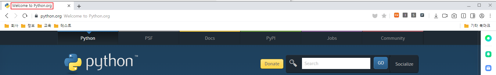
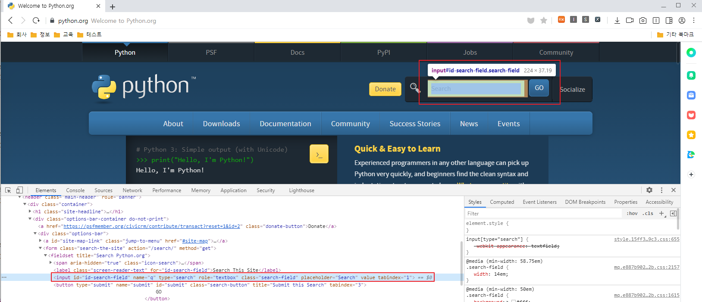
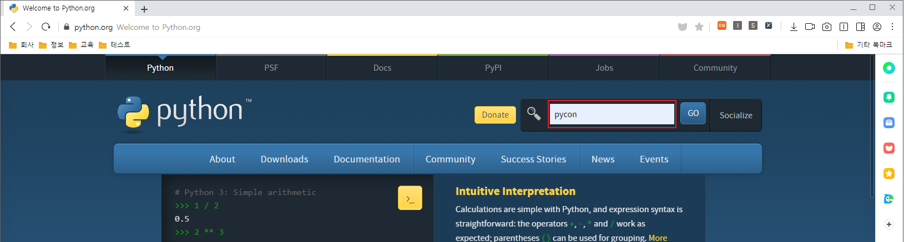
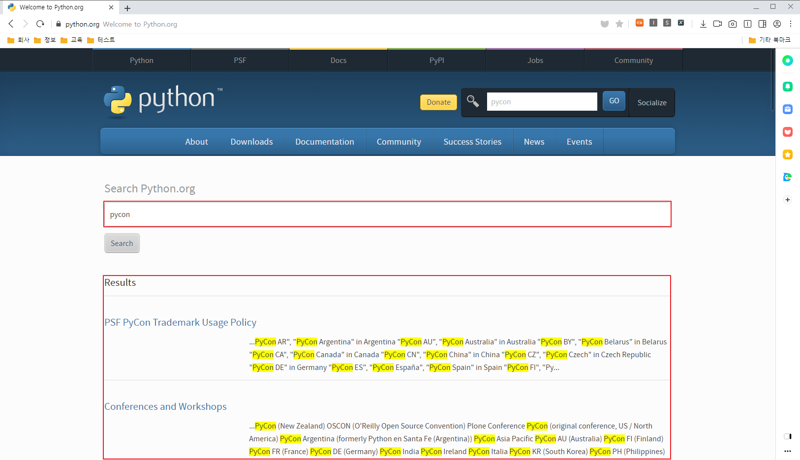
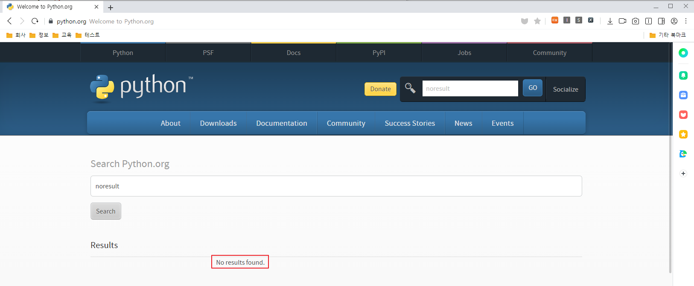

## Selenium - 001 - 셀레니움이란 ?


Selenium 은 웹 브라우저 자동화를 위한 라이브러리의 모음으로써 이미 많은 곳에서 사용되고 있다.

현재 상용화된 GUI 자동화에도 이미 많이 쓰이고 있으며, SeleniumBase 같은 조금 더 간결한 수많은 파생 라이브러리를 탄생 시키기도 하였다.


### Selenium ?

Selenium 은 웹 브라우저 자동화를 위한 도구이다.
각 실행되는 OS 에 맞는 드라이버를 사용하여, 입력, 선택, 드레그, 더블클릭, 마우스 이동, JavaScript 실행 및 액션체인 같은 기능으로 웹 브라우저의 GUI 자동화를 수행할 수 있다.

* 2004년 Selenium 1 버전이 출시되었다.

Selenium 과는 별개로, 테스트 자동화가 모든것을 해결하지는 않는다고 생각한다.
테스트 엔지니어는 항상 자동화와 수동의 적절한 유지로 리소스 대비 효울적인 커버리지를 산출하여 적용해야 한다.
특히, 자주 바뀌는 GUI 가 존재한다면 이는 자동화로 들어가는 리소스보다 수동으로 확인하는 것이 더 효율적일 수 있다.

### Selenium 설치

```python
pip install selenium
```

### Selenium 드라이버 다운로드

```python
Chrome = https://sites.google.com/a/chromium.org/chromedriver/downloads
Edge = https://developer.microsoft.com/en-us/microsoft-edge/tools/webdriver/
Firefox = https://github.com/mozilla/geckodriver/releases
Safari = https://webkit.org/blog/6900/webdriver-support-in-safari-10/
```

### Selenium 시작하기

Selenium 은 비 개발자 사용자의 편의를 위해, IDE 로 쉽게 엘레먼트를 수행하고 저장할 수 있도록 Selenium IDE 라는 도구를 Chrome, Firefox 확장 플러그인으로 제공한다.
하지만 결국 최종적으로 엘레먼트의 관리 효율성을 위해서는 직접 Xpath 또는 CSS 문법을 배워
직접 엘러먼트 경로 및 특정할 수 있는 방법을 찾는것을 추천한다.

:::info 참고
이 문서에서는 Selenium IDE 에 대해서는 별도로 설명하지 않는다. 
:::

``` 기본예제 ```
```python
from selenium import webdriver
from selenium.webdriver.common.keys import Keys

driver = webdriver.Firefox()
driver.get("http://www.python.org")
assert "Python" in driver.title
elem = driver.find_element_by_name("q")
elem.clear()
elem.send_keys("pycon")
elem.send_keys(Keys.RETURN)
assert "No results found." not in driver.page_source
driver.close()
```

위의 예제는 기본적으로 **http://www.python.org 에 접속**하여, **타이틀이 "Python" 임을 확인**하고, 엘레먼트의 **name 이 "q" 인 항목을 찾아 지운 후, "pycon" 을 입력하여 엔터버튼을 선택**, 결과 페이지에서 **"No results found." 라는 페이지 소스가 반환되지 않는것을 확인**하는 예제이다.

이를 순서대로 설명하면 다음과 같다.

```python
from selenium import webdriver
from selenium.webdriver.common.keys import Keys
# 설치한 selenium 에서 사용하고자 하는 필요한 Lib 를 import 한다는 의미이다.
```

```python
driver = webdriver.Firefox()
# import 한 webdriver 의 firefox 를 driver 라는 변수로 선언한다는 의미이다.
```

```python
driver.get("http://www.python.org")
# 변수로 선언한 driver 는 입력된 "http://www.python.org" 의 주로를 얻는다는 의미이다. (해당 사이트로 이동)
```

```python
assert "Python" in driver.title
# 이동한 주소의 title 정보를 얻어와 title 정보에 "Python" 가 있는지를 확인하는 의미이다.
```


```python
elem = driver.find_element_by_name("q")
# 이동한 주소에서 유형이 name 이고, 해당 속성값이 "q" 인 엘러먼트를 찾아 elem 이라는 변수로 선언한다는 의미이다.
```


```python
elem.clear()
# 선언된 elem 이라는 변수에 입력 또는 노출된 문자를 초기화한다는 의미이다.
```

```python
elem.send_keys("pycon")
# 선언된 elem 이라는 변수에 "pycon" 이라는 문자열을 입력한다는 의미이다.
```


```python
elem.send_keys(Keys.RETURN)
# 선언된 elem 이라는 변수에 엔터를 선택한다는 의미이다.
```

```python
assert "No results found." not in driver.page_source
# page 정보를 얻어와 "No results found." 이 없음을 확인한다는 의미이다.
```
* 검색결과가 있을 경우


* 검색결과가 없을 경우


```python
driver.close()
# 선언된 driver 를 종료한다는 의미이다.
```

Selenium TAB 에서는 Selenium 에 대한 개념 설명 및 Python 을 기준으로 세팅 및 여러가지의 TIP 의 내용을 공유하고자 한다.


작성자 : 현의노래

작성일 : 2021년 06월 22일