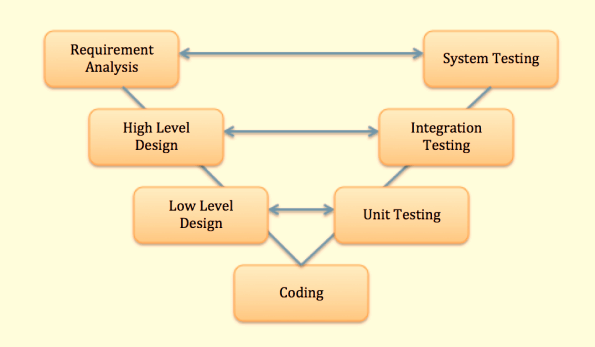

## Validation & Verification

흔히 V&V 로 불리며, 많이들 헷갈리는 개념중에 하나일 것이다.

가장 기본적이지만 의외로 많이들 잘못 알고 있고, 많이들 헷갈리는 개념인 Validation & Verification 에 대해서는 이미 **팀블로그 **글 중 [Verification과 Validation에 대해 ISTQB 설명은 명확히 이해가 안 돼요](https://softwaretestingreference.tistory.com/159?category=837866) 에서 자세하게 차이점을 설명하였지만 다시 한번, 이번글에서 설명을 하고자 한다.

V&V 에 대해서는 이미 IEEE Computer Society Press 의 소프트웨어 리스크 관리 저자인 **Boehm** 가 아주 간단명료하게 두가지의 표현으로 정의를 하였다.

* Are we building the system right?  (우리는 제품을 올바르게 만들고 있는가 ?)
* Are we building the right system?  (우리는 올바른 제품을 만들고 있는가 ?)

위의 예시처럼 제품을 올바르게 만들고 있는지, 올바른 제품을 만들고 있는지로 기억을 하면 쉽게 이해가 갈 것 같다.

### Are we building the system right?

우리는 제품을 올바르게 만들고 있는가 ? 의역한 내용대로 제품을 올바르게 만들고 있는지에 대한 부분을 간략하게 표현한 것이다.

제품을 올바르게 만든다. 이말은 곧, 무언가 사전에 협의된 내용이 존재한다는 것이고 그 협의된 내용대로 만들어지고 있는지를 확인하는 단계라고 생각하면 될 것같다.

이 단계를 바로, **Verification** 라고 하며 흔히들 **확인** 이라는 표현을 쓴다.

사전에 정의된 요구사항 정의서에 만족하는 제품이 구현되었는지를 **확인** 하는 단계로, 이는 제품의 중단 단위 또는 제품의 마지막 단계에서 해당 제품의 구현여부를 **확인** 하게 된다.

V-model 로 예를 들자면, 다음과 같은 단계에서 사전 산출물 대로 올바르게 제품이 만들어 졌는지 확인 할 수 있다.

* 요구사항 분석에 대한 결과물은 시스템 테스팅 단계
* 상위레벨의 설계는 통합 테스팅의 단계
* 하위레벨의 설계는 유닛 테스팅의 단계

참조 : V-model (https://www.guru99.com/v-model-software-testing.html) 

이런 단계를 거쳐 제품이 산출물을 기준으로 올바르게 만들어 졌는지 **확인** 함으로써, 해당 제품의 구현도에 대한 객관적 지표로 활용할 수 있는 것이다.

### Are we building the right system? 

그렇다면 우리는 올바른 제품을 만들고 있는가 ? 는 어떤 부분을 의미하는 것일까 ? 의역한 내용 대로 올바른 제품을 만들기 위한 절차, 방법등에 대한 **검증** 을 한다고 생각하면 될 것 같다. 그렇기에 이 단계를 흔히들 **Validation** 이라고 부른다.

고객이 원하던 제품이건, 임원진이 원하는 제품이건 결국 그 제품을 만들기 위해서 수많은 인터뷰, 리뷰 등이 진행이 될것이고 요구사항이 수집이 될 것이다.

그렇다면 우리는 그 요구사항을 리뷰하여 고객이 또는 임원이 원하는 제품인가 ? 를 진행하게 될 것이고.

그다음 상위레벨의 디자인 (시스템에 대한 설계) 하위레벨의 디자인 (모듈, 기능 단위의 설계), 그외에도 기획서, TC 등을 리뷰하면서 해당 제품이 정말 올바른 제품인지를 **검증** 하게 되는 것이다.

여담이지만, 이 요구사항 단계에서 고객이 원하는 요구사항을 뽑아낼 수 있도록 기획자는 수많은 방법론을 사용해 요구사항을 도출하지만 결국 "고객도 고객이 원하는것을 모른다." 그렇기에 "고객의 Needs 를 빠르게 충족하자" 라는 가치있는 제품으로 진정한 고객의 Needs 를 만족하기 위해 탄생한게.. Agile 이다.

(물론, 한국은 거의 K-Agile.. 댕댕이자일이라고 불..)

아무튼, 실제로 업무를 진행하다 보면 애매모호한 영역은 분명히 존재하지만 가장 기본적인 위의 두 명제를 기억하면 의외로 쉽게 구분이 될 것이다.

**우리는 고객(또는 임원)이 원하는 올바른 제품**을 만들어 가고 있는가 ? **Validation** 

**우리는 고객(또는 임원)이 원했던 제품을 올바르게** 만들고 있는가 ? **Verification** 

작성자 : 현의노래

작성일 : 2021년 07월 23일