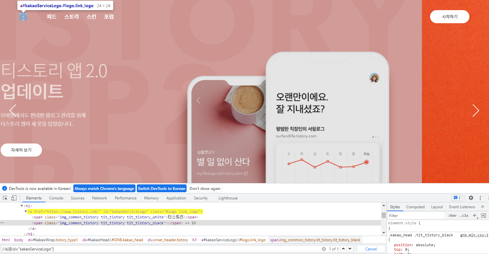
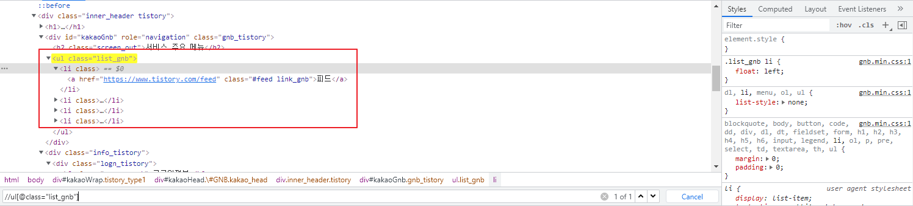
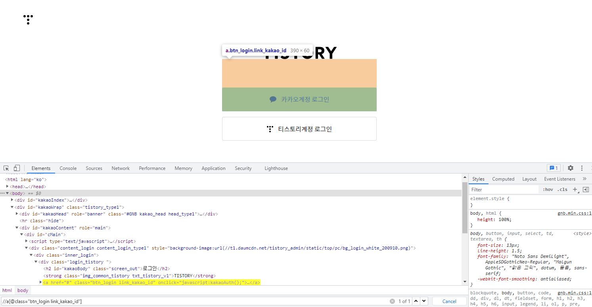
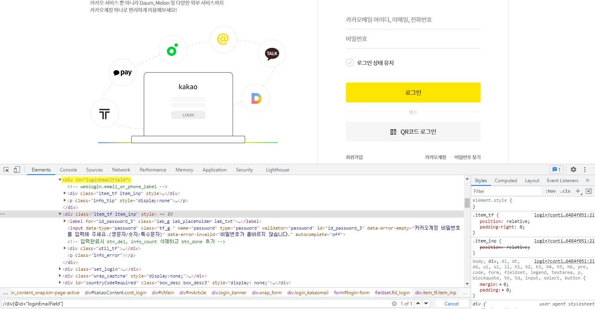
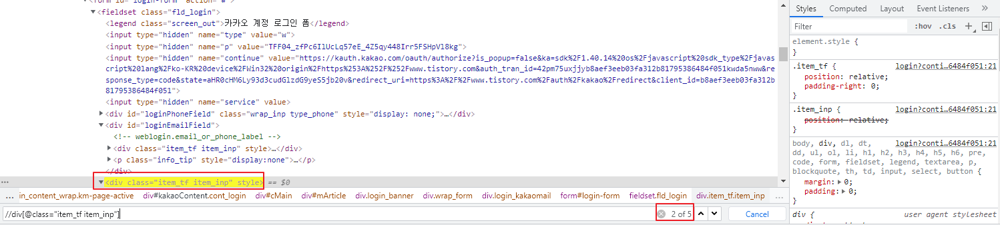
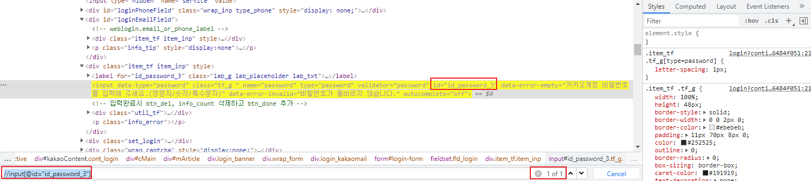

## Selenium - 008 - Selenium 실전편 Part 03 로케이터 작성

이 글에서 예시로 사용되는 정보는 다음과 같다.

- Python 3.7.7
- Selenium 3.141.0
- Pytest 6.2.1


```목차```

1. [임의의 사이트 선정 및 자동화할 영역, 기능등에 대한 범위 선정](https://qa-linesong.netlify.app/docs/doc23)
2. [테스트 자동화 스크립트의 형상관리 & POM 구조 작성](https://qa-linesong.netlify.app/docs/doc24)
3. **로케이터 및 페이지 작성**
4. 자동화 스크립트 작성 (테스트 케이스, 테스트 시나리오)


### 1) 로케이터 작성


자, 이제 로케이터에 대한 작성을 해보도록 하자.

css, Xpath 등 추후 사용 시, 구분자로 사용할 수 있는 방법으로 저장을 하면 된다.

필자는 주로 Xpath 를 사용함으로, 예시에도 Xpath 를 기준으로 작성하도록 하겠다.

최초, [Selenium 실전편 Part 01]() 에서 정의 한 기본 노출과 기능을 다시 한번 확인하면 다음과 같다.


```기본 노출```

1. 비 로그인 시, 메인화면 노출
   
   - 헤더 메뉴 (메인링크아이콘, 피드, 스토리, 스킨, 포럼, 시작하기)
2. 로그인 페이지
   
   - 카카오 계정 로그인 페이지
3. 로그인 시, 메인화면 노출
   
   - 헤더 메뉴 (메인링크아이콘, 피드, 스토리, 스킨, 포럼, 시작하기)
4. 로그인 후, 로그인 영역 간편 메뉴 노출
   - 로그인 영역
   - 간편 메뉴 영역
   
   

```기본 기능```

1. 비 로그인 시, 메뉴 클릭 시 로그인 페이지 노출 기능
2. 비 로그인 시, 시작하기 클릭 시 로그인 페이지 노출 기능
3. 로그인 후, 글쓰기 기능


``` 페인 페이지```

위에서 설명한, 로케이터 작성을 해보자 간략하게 메인 페이지 에서는 다음과 같은 로케이터를 구분자로 만들어야 한다.

<div style={{textAlign: 'center'}}>



</div>

<p align="center">메인 페이지 개발자 모드에서 로케이터 획득</p>


1) 메인링크 아이콘 : //a[@id="kakaoServiceLogo"]


2) 링크 : 링크 같은 경우 개발자 모드에서 확인 시, //ul[@class="list_gnb"] 하위에 **/li/a href** 로 동일하게 리스트 되어 있는것을 확인할 수 있다.

* Elements 를 이용하여, 배열로 값을 받아 사용해도 된다. 경우에 따라 가장 효율적인 방법을 선택 하자.

<div style={{textAlign: 'center'}}>



</div>


이럴 경우에는 Contains() 같은 방법으로 구분을 지어도 상관 없다. 

* 피드 : //a[contains(text(), "피드")]
* 스토리 : //a[contains(text(), "스토리")]
* 스킨 : //a[contains(text(), "스킨")]
* 포럼 : //a[contains(text(), "포럼")]


3) 시작하기 버튼 : //a[@class="btn_tistory btn_log_info" and contains(text(), "시작하기")]

※ 시작하기 버튼은 이미 Class 명으로도 구분이 가능하지만, contains 중복 사용을 할 경우, 더욱 더 유니크한 구분자로 사용할 수 있기에 다중 조건을 추가 하였다.


``` 로그인 페이지```

로그인 페이지 로케이터를 작성 해보자. 필자는 [카카오계정] 으로 로그인 할 것 이기 떄문에 로그인 상세 페이지는 카카오 로그인 페이지만 로케이터를 작성한다.

<div style={{textAlign: 'center'}}>



</div>

<p align="center">로그인 페이지 개발자 모드에서 로케이터 획득</p>


1) 카카오계정 로그인 링크 : //a[@class="btn_login link_kakao_id"]

2) 티스토리계정 로그인 링크 : //a[@class="btn_login link_tistory_id"]

※ 카카오계정으로 티스토리 시작하기는 1) 항목의 카카오계정 로그인 링크와 링크 주소가 동일하여 제외 하였다.


``` 카카오 로그인 페이지```

필자는 카카오 계정으로 로그인을 할 것이기 때문에 카카오 로그인 페이지만 로케이터 작업을 진행한다.

<div style={{textAlign: 'center'}}>



</div>

<p align="center">카카오 계정 로그인 페이지 개발자 모드에서 로케이터 획득</p>


1) 아이디 : //div[@id="loginEmailField"]
2) 비밀번호 : //input[@id="id_password_3"]

※ 로케이터 구분 작업을 진행하다보면 하기 사진 처럼 동일한 엘리먼트가 노출되는 경우가 있다 이런 경우에는 하단 또는 상단을 이용하여 유니크한 구분자로 만들어 둬야 한다.

<div style={{textAlign: 'center'}}>



</div>

<p align="center">참고01 비밀번호 로케이터 class 로 구분시, 5개의 동일한 엘리먼트가 존재</p>

<div style={{textAlign: 'center'}}>



</div>

<p align="center">참고02 class 하단의 유니크한 id 로 비밀번호 로케이터를 구분</p>


이런식으로 작성 페이지 별로 이전에 설명한 Locator 폴더에 별도로 관리를 하면 해당 엘리먼트가 변경되어도 해당 폴더의 해당 locator_페이지명 의 엘리먼트 정보를 변경하면 되기에 훨씬 유연하고 편리한 로케이터 관리를 할 수 있다.


다음 장에서는 해당 로케이터를 작성 했다는 가정 하에, 페이지 작성법을 다루도록 하겠다.


작성자 : 현의노래

작성일 : 2021년 11월 22일